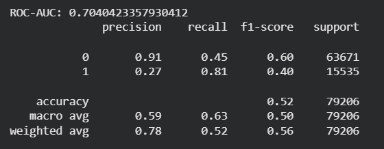
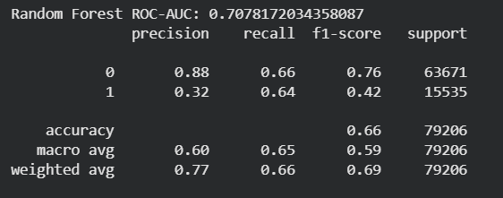
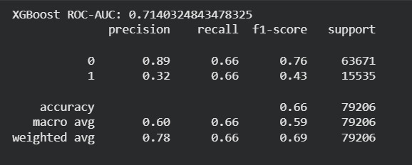
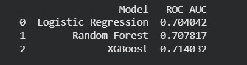
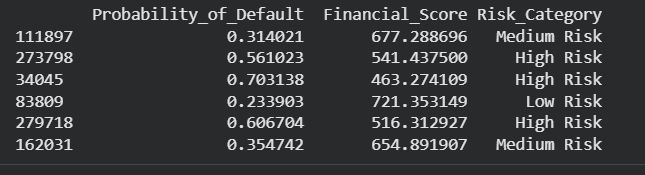
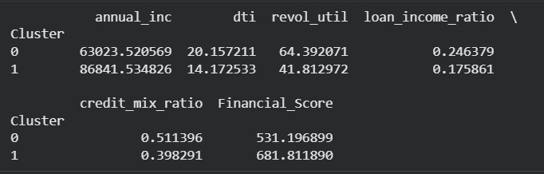

# AI-Financial-Risk-Intelligence-System

## 📌 Project Overview

This project is an end-to-end **AI-powered financial risk analysis system** built using real-world lending data.  
It simulates how financial institutions assess borrowers by combining:

- Credit risk prediction  
- Financial scoring (300–850 range)  
- Risk segmentation (High / Medium / Low)  
- Customer segmentation using clustering  
- AI-based explanation using LLM  

The system transforms raw borrower data into **actionable financial insights**, bridging machine learning with real-world financial decision-making.

---

## 🚀 Features

✨ Data cleaning and preprocessing of real-world dataset  
✨ Feature engineering using financial ratios  
✨ Multiple ML models for risk prediction  
✨ Financial score generation (like credit score systems)  
✨ Risk categorization based on score  
✨ Customer segmentation using clustering  
✨ LLM chatbot for explanations and insights  

---

## 📊 Models Used

### 🔹 Logistic Regression
A baseline model used for probability-based classification.  
Provides interpretability but struggles with complex patterns.

📸 Result:

📌 Performance Insight:
- ROC-AUC ~ 0.70  
- Good baseline model  
- Lower recall for default class → misses risky borrowers  

---

### 🔹 Random Forest
An ensemble model that improves performance by combining multiple decision trees.

📸 Result:

📌 Performance Insight:
- Better than Logistic Regression  
- Handles non-linear relationships  
- Improved recall and stability  

---

### 🔹 XGBoost (Best Model)
A gradient boosting model that optimizes performance through sequential learning.

📸 Result:

📌 Performance Insight:
- Best ROC-AUC (~0.71+)  
- Strong balance between precision and recall  
- Captures complex financial patterns effectively  

---

### 📊 Model Comparison

📸 Comparison:

📌 Insight:
XGBoost performs the best overall, making it the most suitable model for financial risk prediction in this project.

---

## 💳 Financial Score System

Model predictions (Probability of Default) are transformed into a **financial score (300–850)**:

- Higher probability of default → Lower financial score → Higher risk  
- Lower probability of default → Higher financial score → Lower risk  

📸 Example Output:

📌 Insight:
This step converts ML output into a **business-friendly decision system**, similar to real-world credit scoring models used by financial institutions.

---

## 🧩 Clustering (Customer Segmentation)

K-Means clustering is used to group users based on financial behavior.

📸 Clustering Result:

📌 Insight:
- One cluster represents **high-risk financial behavior**  
- Another represents **financially stable users**  
- Helps in segmentation and targeted decision-making  

---

## 🤖 LLM Chatbot

An AI-powered chatbot is integrated to make the system **interactive and explainable**.

📸 Demo:

💬 Users can ask:
- Why is my score low?  
- Which model performed best?  
- How to improve financial score?  
- What do clusters mean?  

📌 Insight:
The LLM converts technical outputs into **human-understandable explanations**, improving usability.

---

## 📂 Dataset (Lending Club)

This project uses the **Lending Club Loan Dataset**, a real-world dataset from a peer-to-peer lending platform.

### 📌 Includes:
- Loan amount  
- Interest rate  
- Annual income  
- Debt-to-income ratio (DTI)  
- Credit utilization  
- Number of accounts  
- Loan status (default or not)  

### 🎯 Purpose:
Used to model **borrower default risk and financial behavior**, making it ideal for building real-world credit systems.

---

**📊 Applications in Finance:**
This approach is not limited to banking systems. It can be applied across multiple financial domains, including:

- 🏦 Banking – Loan approval and credit risk assessment  
- 💳 Fintech – Digital lending and user risk profiling  
- 🏢 NBFCs – Alternative credit scoring for underserved users  
- 📈 Investment Firms – Risk profiling of clients  
- 💼 Wealth Management – Portfolio risk categorization  
- 🛡️ Insurance – Policy risk evaluation and premium pricing  

👉 The system enables organizations to **quantify risk, segment users, and make data-driven financial decisions**.

---

## 🏆 Conclusion

This project combines:

- Machine Learning (classification)  
- Financial scoring systems  
- Customer segmentation  
- AI explainability (LLM)  

👉 It simulates how **financial institutions evaluate risk and make credit decisions**.

---

## 🔗 Future Enhancements

- Web application integration (Angular + FastAPI)

---

## ⭐ If you found this useful

Give this repo a ⭐ and connect with me!
